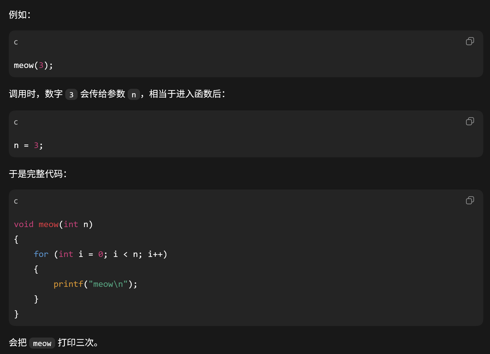
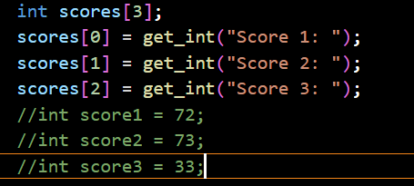
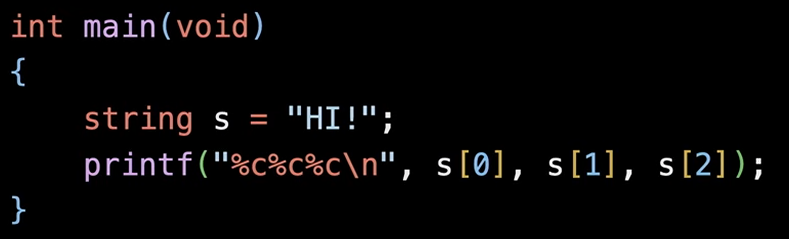
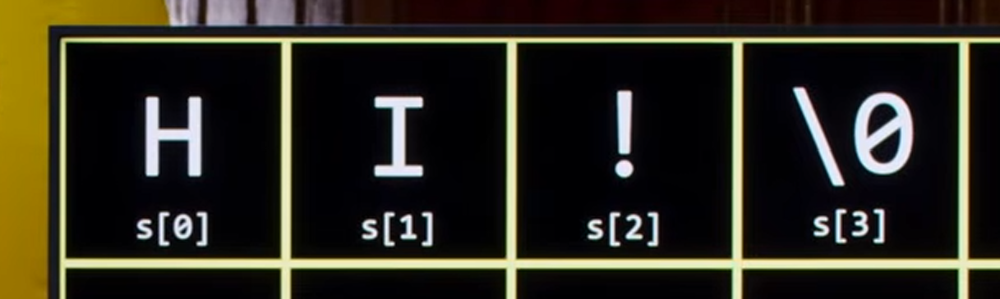
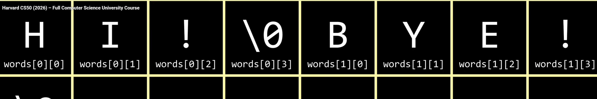
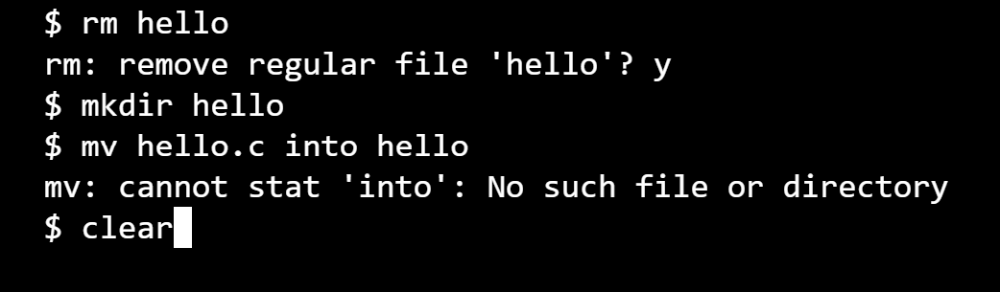
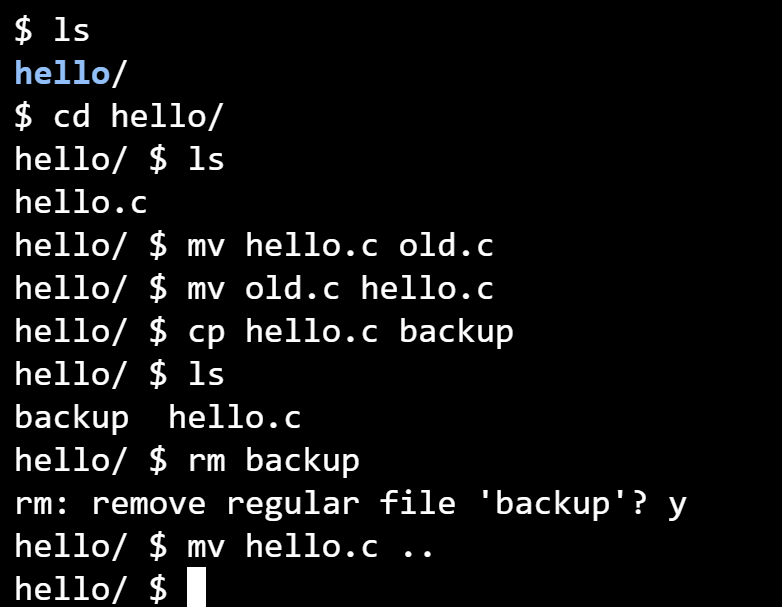

# basic logic
## input--algorithm--output

## arguments--function--side effects/return value

## binary 2进制讲述--scratch演示项目

## source code --compiler --machine code
what the computer is acutually do and what it is supposed to do?
### code hello.c -- make hello -- ./hello
### clang hello.c -- ./a.out
clang hello.c --lcs50//makes the computer know what the zeros and ones are that belong to the get string function
clang -o hello hello.c -lcs50
run make is just automating
## command-line arguments//all of the things you type after the program name
## compile means preprocessing, compiling, assembling, linking
一个不断向二进制转换然后最终连接起来的过程，preprocessing是将主函数的内容复制并粘贴到头文件中的过程。，compiling会转换成汇编语言
## what the header file do for us
## decompiling

# C

= < > <= >= == !=

## escape sequences转义序列:
\n \r \"  \' \\

几乎所有的代码实现都是以行为基础的，你需要在行内完成你要是实现的内容

library is code someone else wrote that you can use
## type of data that we can store
bool：True or False
char：individual character
double float int long
string

get_double;get_string;get_long;get_int;get_float;get_double;get_char

## Placeholder
%c %f %i %li %s

## variable

## loop
ctrl c is something that you can take control over your code when you get into the endless loop

## void
void meow(int n)
void     meow     (int n)
返回类型  函数名    参数

## Prototype
Copy the first line of the function and put that one line and only that one line with a semicolon
It is to tell the computer there will be a function called XX in advance.

## correctness,design,style

correctness just means it behaves as it should 
design not only correct but doing it well
style: does everything pretty printed that is nicely indented? are variables well-named and not just called xyz arbitrarily or something like that

## constants

## cheat sheet of some of the opearators
+ - * / %

## reboot the code--to reset the variable

## truncation

## floating-point imprecision

## Year 2038 program
计时系统从秒开始来计数

## cryptography
## bug and debugging
### printf
### debugging:
It means that you can pause and work through things at your own pace and poke around
inside of your own code.
### break point thing is?
where your code will break
程序代码中设置的一个标记，一旦执行到断点处，程序会暂停执行，进入调试模式。
这允许开发者检查程序的状态，例如变量的值，程序执行流程等，以便找出代码的错误或进行行为分析。

### rubber duck debugging

## data storage and arrays
定义每一个变量-->直接生成数组
    printf("Average: %.2f\n", (scores[0] + scores[1] + scores[2]) / 3.0);
    //printf("Average: %.2f\n", (score1 + score2 + score3) / 3.0);//一个浮点数，所有都会变成浮点数
数组中的元素必须是连续的

现在储存空间是一样的，但只需要处理一个变量

一旦数组存在，可以直接通过访问数组访问那一块数据的存储空间

### string
an array of characters
在计算机存储中存在将字符转换成数字的这种形式；

char用单引号，string用双引号(双引号让计算机自动编译结束的那八个0，相当于你用Hi!这个字符串的时候实际输进去是4个bytes)。

计算机会自动为我们输入的字符串做终止处理，最后一位是八位的00000000
that is a \0

对输入的语句进行编辑，string数组就变成了存在行和列相对位置的数据框

int main(void)
{
    string words[2];
    words[0] = "HI!";
    words[1] = "BYE!";
    printf("%c %c %c\n", words[0][0], words[0][1], words[0][2])
    printf("%c %c %c\n", words[1][0], words[1][1], words[1][2]，words[1][3]);
}

# Linux
## 文件与目录
cd
cp
ls
mkdir
mv
rm
rmdir

